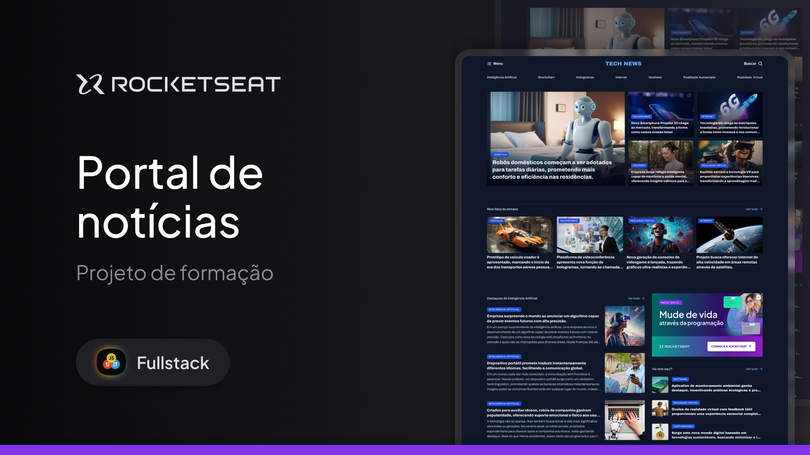

<h1 align="center"> PROJETO Portal de notícias</h1>

Neste projeto de portal de notícias, estudamos mais sobre o GRID.

  <a href="#-tecnologias">Tecnologias</a>&nbsp;&nbsp;&nbsp;|&nbsp;&nbsp;&nbsp;
  <a href="#-projeto">Projeto</a>&nbsp;&nbsp;&nbsp;|&nbsp;&nbsp;&nbsp;
  <a href="#-layout">Layout</a>&nbsp;&nbsp;&nbsp;|&nbsp;&nbsp;&nbsp;

 

  

## 🚀 Tecnologias

Esse projeto foi desenvolvido com as seguintes tecnologias:

- HTML e CSS
- Git e Github
- Figma

## 💻 Projeto

Este projeto foi realizado com base nas aulas do Rocketseat no curso de Full-Stack.

## 🔖 Layout

Você pode visualizar o layout do projeto através [DESSE LINK](https://www.figma.com/design/50XMdfMJF0BrgwSzORMtyw/Portal-de-not%C3%ADcias--Community-?node-id=0-1&p=f&t=JxB9vWxzAaoHoAMk-0). É necessário ter conta no [Figma](https://figma.com) para acessá-lo.